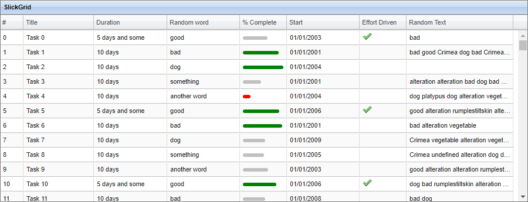

## Auto Column Sizing

### TL;DR

The Auto Column Sizing option is designed to allow the grid to make intelligent choices about the width of its columns based on the cell content of the header and rows.  

This page contains an in-depth discussion of how the column autosizing API works.
However, the default column strategy of 'ContentIntelligent' sizing works reasonably well, and you may be happy merely to leave the settings at their defaults and let the magic happen.
The only overall issue with autosizing is that there must be data present to test for size - it's very hard for an automated sizing algorithm to work without any data! In the case of no data, you'll probably find that columns are assigned to the width of their header captions, which looks fine anyway.

There is a very comprehensive example [here](http://6pac.github.io/SlickGrid/examples/example-size-to-content.html) which has an example grid that you can use as a sandbox to try out various settings.

The basic autosize modes, passed as a Slickgrid option, are as follows:

- None: Don't autosize (return without doing anything)
- Legacy: Use the legacy Slickgrid autosize algorithm
- IgnoreViewport: Size the columns without worrying about viewport width, so that if the columns are smaller than the viewport, there is empty space at the right, or if the columns are larger than the viewport, there is a scrollbar
- FitColsToViewport: Fit the columns to the viewport by scaling or designating 'size to fit' columns that take up any remaining space in the viewport
- FitViewportToCols: Change the viewport width to match the total column width

Setting up is as simple as this:

    var options = {
      enableCellNavigation: true,
      autosizeColsMode: Slick.GridAutosizeColsMode.FitColsToViewport
    };
    
    $(function () {
      dataView = new Slick.Data.DataView();
      // autosizing happens on init
      grid = new Slick.Grid("#myGrid", dataView, columns, options);
      ....
      // later, when something has changed, maually autosize
      grid.autosizeColumns();

So now, for the curious, read on for the gory details of how and why the API works.

### Overview of Issues

You would think that autosizing a grid column to its contents would be straightforward - just iterate the data and test the widths. For small datasets this is workable, but unfortunately, with the subtleties of formatting or various types of data, and the slow performance of html based width checking, getting it right for millions of rows is a lot harder than it looks.  
The sizing API may seem at first sight to be over-complex for what it does, however the reason behind this is that it is all about using smart strategies that will give just as good width detection results without actually having to iterate all of the data rows. This section seeks to illustrate some of the issues that drive the API design.

The example linked in the previous section works on 500,000 rows of data. If you want to see the performance of the non-optimised version of the width testing, just try changing ContentIntelligent to Content for a single column, and watch the performance go from 200 milliseconds to 100 seconds! 

Individual text character width is a primary consideration. In any but a monospaced font, we will find that the text 'mmmmm' is much wider than 'iiiii'. This means that we cannot simply find the string with the longest length and use that as an indicator of maximum width. Of course, in real life, text will generally conform to a fairly standard distribution of characters, and so the maximum length string plus a percentage allowance of space might be an excellent estimate.

Where the browser supports a canvas object, we can use that to get an accurate text width for a given string in the font used. An indicative time for this is around 40ms to evaluate the width of 1000 strings.

Alternatively, we can create a small segment of HTML in the area to be tested and find the width using the DOM. This is much slower than using a canvas, and speed is likely to depend also on the complexity of the page, since page reflows are likely to be involved. However, we can get the width of non-text HTML elements. An indicative time for this is around 1400ms (1.4 sec) to process 1000 data items. Clearly we want to use this technique as judiciously as possible. While the canvas technique is much faster, it will have to fall through to the HTML technique if canvas is not supported by the browser, so this makes the HTML method our baseline for performace.

Another strategy to improve speed would be, rather than to test the width of every row value for a column, to *pre-iterate* and build a list of unique values before doing the HTML/canvas testing. This would eliminate the slow testing of multiple instances of the same value.

### An Example Grid

Let's consider each column from the following grid:



*'#' - Ascending numeric column*

The first column simply contains the the row index. An obvious strategy is to assume that rendering the maximum number will give the greatest width (digit character width may vary, but appears to be very similar other than for a 1).  A better strategy would be to start with the highest number and then substitute the widest digit for each digit (eg. highest number is 1420, use 9999). A third strategy might be to simply specify the largest number we ever expect to need, rather than looking at data values at all.  
When initialising the grid, if the grid is sorted ascending on row index, then the highest number is the last row. Perhaps we should test the last and first rows to allow for ascending or descending sorts. After initialisation, the grid may be sorted on other column data so the data values from this column would need to be iterated to find the highest.

*'Title' - Short text column with numeric component*

The second column contains text based on the the row index. Because the data value is no longer numeric, many of the strategies for the row index column won't work. Again, an effective method might be to specify up front 'Task 99999' with the largest number, rather than iterating.  Other than this, iteration looks like the only option. Again, we could use the fact that the largest number will be in the final row on initialisation of the grid.
 
*'Duration' - Preset text options*

The third column contains three preset options for its text, a lot like a drop down. If we could pass the list of possible values directly to the API, they could be tested for length rather than having to iterate through the data and find the unique values present.

*'Random Word' - Random words*

The fourth column is similar to the third, but potentially with a much larger number of options. If this were truly random, then iterating data values and building a list of distinct values for width testing would be the most efficient. If the words were totally random, with no or very few repetitions, it might be quicker to process the row as-is rather than build a unique value dictionary. This is a decision based on the nature of the data.

*'% Complate' - HTML Cell*

The fifth column becomes more interesting. This is not text, but an HTML image based cell based on a number from 0-100. It doesn't make sense to analyse the row data when we know that 100% will be the widest we will ever need, even if that value doesn't currently exist in the data (eg. the highest row value present for the column may be 85, but we could edit it to be 100). We should be able to pass the value 100 to the API.

*'Start' - Date column*

The sixth column is a date valued column. The widest date depends on the format used, but 'September 30th, 2009' is generally a good 'widest date'. Again, we are better passing in this fixed value to the API rather than testing the data. Note also that if we tested the first few rows, the widths would be very close to all the other rows, if we added a small percentage allowance of space. This would be a viable secondary strategy.

*'Effort Driven' - Checkbox*

The seventh column is a tick icon based on a boolean column, so it is very easy to test all possible values (there are only two, or possibly three if we include null). We could pass in 'true' as a maximum value. We can also observe that the column contents are so small that the title will always be wider than the cell contents.

*'Random Text '- 'Comment' type column*

The last column is text of an extremely variable length. In real applications, this is nearly always a 'comments' or 'notes' field of some sort. It is clear that the full field will never fit in the allotted space, but it is nonetheless useful to get a few words displayed, and there may be a 'tooltip' option for the full text. This kind of field is good to assign as a *variable width* column, that takes up the space left over in the grid window after the other more precisely sized columns have been set up.

## Grid and Column Options

Now that we've covered an example, let's go on with the actual API settings. They will directly correlate with the issues discussed above.

### Grid Options

Grid options are for the overall viewport behaviour, plus some global scaling and padding factors that are used for all columns.
These options are to be passed to the grid constructor. The defaults are shown in the JSON object below:

    var options = {
      autosizeColsMode: Slick.GridAutosizeColsMode.None,
      autosizeColPaddingPx: 2,
      autosizeTextAvgToMWidthRatio: 0.75,
      viewportSwitchToScrollModeWidthPercent: undefined,
      viewportMinWidthPx: undefined,
      viewportMaxWidthPx: undefined
    };

Note that the legacy option (*forceFitColumns*) is no longer used, but if specified, if will set the *colAutosizeMode* to 'Legacy', which replicates the old behaviour.


**options.autosizeColsMode**

A named mode (details below) defining the relationship between the viewport and the total column width.
     
> *None*
> 
>   - no resizing is done, autosize mode is effectively switched off
> 
> *Legacy*
>   - resize using previous SlickGrid *forceFitColumns* behaviour 
>
> *IgnoreViewport*
>   - columns are auto-sized independently of the viewport width. There will be empty space at the right of the viewport if the columns are smaller, and a horizontal scroll bar if they are larger.
> 
> *FitColsToViewport*
>   - columns sizes are calculated using the column strategies
>   - if addl space remains in the viewport and there are columns marked *sizeToRemaining*, just the SizeToRemaining cols expand proportionally to fill viewport
>   - if the total columns width is wider than the viewport by *viewportSwitchToScrollModeWidthPercent*, switch to IgnoreViewport mode. For example if viewportSwitchToScrollModeWidthPercent is  set to 120 and the total column widths are 130% of the viewport size, then IgnoreViewport mode will be used (see below for further details).
>   - otherwise (ie. no SizeToRemaining cols or viewport smaller than columns) all cols other than ones marked *Locked* scale in proportion to fill the viewport
> 
> *FitViewportToCols*
>   - columns sizes are calculated using the column strategies
>   - if viewport with is outside viewportMinWidthPx and viewportMaxWidthPx, then the viewport is set to viewportMinWidthPx or viewportMaxWidthPx, and the FitColsToViewport algorithm is used
>   - viewport is resized to fit columns


**options.viewportSwitchToScrollModeWidthPercent**

In FitColsToViewport mode, if the columns are wider than the viewport, they will be reduced proportionally to fit. However, there is a limit to how practical this is - if columns are reduced too much, their contents will be unreadable. This setting specifies a point at which to give up on the idea of reducing the column with, and just accept using a scrollbar.  
For example, a value of 120 means that if the autosized columns add up to wider than 120% of the viewport, then columns will not be resized and scrolling will be used. 


**options.viewportMinWidthPx, options.viewportMaxWidthPx**

In FitViewportToCols mode, there may be a limit to how far the viewport HTML element may be increased or reduced in width. These options set the limits. If the limit is crossed, then the width will be set at the maximum or minimum limit and the FitColsToViewport strategy will be used.


**options.autosizeColPaddingPx**

Additional pixels of padding to be added to the column content size when calculating column width.


**options.autosizeTextAvgToMWidthRatio**

One sizing strategy for text columns finds the longest text string, then substitutes all the characters in it with 'm' and then scales to find an average width. This option is the multiplier to get average text width given a string of 'm's. Of course, actual width depends on content, but since english text has a statistical scatter of characters, this is one method of estimation.

### Column Options

The column options govern the strategy used for each column when calculating content size.
They are passed as part of the 'autosize' object property of the column. The defaults are shown in the JSON object below:

    var columnDefaults = {
      ...
      autoSize: {
        ignoreHeaderText: false,
        colValueArray: undefined,
        allowAddlPercent: undefined,
        formatterOverride: undefined,
        autosizeMode: Slick.ColAutosizeMode.ContentIntelligent,
        rowSelectionModeOnInit: undefined,
        rowSelectionMode: Slick.RowSelectionMode.FirstNRows,
        rowSelectionCount: 100,
        valueFilterMode: Slick.ValueFilterMode.None,
        widthEvalMode: Slick.WidthEvalMode.CanvasTextSize,
        sizeToRemaining: undefined,
        widthPx: undefined,
        colDataTypeOf: undefined
      }
    };

Note that the following column properties are also relevant to autosizing:

    resizable  - is the column user resizable? (autosize will still resize the column unless it is flagged as Locked)
    minWidth - absolute minimum width for the column
    maxWidth - absolute maximum width for the column

The column width of each column can be locked to a particular value, set to a guide width (for later proportional size scaling), or can be based on the widest content.  
Specific columns may be designated to expand to fill extra space.


**column.autoSize.autosizeMode**

A named mode (details below) defining how the size for the column is to be derived.
     
> *Locked*
>   - the column will autosize to its *width* property - autosizing is effectively disabled for the column
> 
> *Guide*
>   - the column will size to its *width* property initially when detecting column size from content, but it may be resized proportionally afterwards if expanding or contracting to fit the viewport.
> 
> *Content*
>   - the strategies and settings specified in the *autoSize* object in the column object will be used to estimate the column width, based on the data for the column.
> 
> *ContentIntelligent*
>   - the data type of the column is scanned, and settings appropriate to that type will be made to the *autoSize* object. This is the fully automatic option. Since it is per-column, you may choose to set the strategies for some columns yourself, but leave the other columns as *ContentIntelligent*. Note that the *colDataTypeOf* property allows a type for the column to be forced.


**column.autoSize.rowSelectionModeOnInit, column.autoSize.rowSelectionMode**

A named mode defining how many rows of data will be used for testing content width. There are two options, one to be used when first initialising the grid, since at that point there may be certain column sorting in place that simplify the decision making, whereas after user interaction there may no longer be any guarantee of particular sort order. If *rowSelectionModeOnInit* is not defined, then *rowSelectionMode* will always be used.

> *FirstRow*: use the first row only (for when data is largely invariant or is sorted descending)
> 
> *FirstNRows*: use the first N rows only, where N is given by the *rowSelectionCount* property
> 
> *AllRows*: use all data rows
> 
> *LastRow*: use the last row only (for when data is sorted ascending)

   
**column.autoSize.rowSelectionCount**

The row selection count used for *FirstNRows* mode.

   
**column.autoSize.valueFilterMode**

A named mode defining how data will be pre-processed before testing for width. For numeric data, we are often only interested in the largest value, for strings, the longest, and if testing data with frequently repeated values, we'd like to be able to remove the duplicates before testing. Note that these are all only in the interest of speed - the only 100% accurate results coming from testing the HTML for each and every row, but for large datasets this can become prohibitively slow. Here we are trying to apply smart algorithms to minimise time spent evalitating width, with either no or minimal tradeoff in accuracy.
     
> *None*: use the raw data
> 
> *DeDuplicate*: create a new list of unique values from the data, and use that for testing
> 
> *GetGreatestAndSub*: for numerics, get the greatest absolute number, substitute each character in it for a '9', and use that single value for testing
> 
> *GetLongestTextAndSub*: for strings, get the longest string, substitute each characater in it for an 'm', scale it with *options.autosizeTextAvgToMWidthRatio*, and use that single value for testing
>      
> *GetLongestText*: for strings, get the longest string and use that single value for testing. As part of this strategy, it is expected that *allowAddlPercent* will be set (ContentIntelligent chooses GetLongestText with allowAddlPercent=5) to allow for shorter strings containing wider characters.


**column.autoSize.widthEvalMode**

A named mode defining how width will be measured. The *canvas* feature of the browser offers very fast width measurement of text, and can be used to pre-measure a set of text values, with the longest then being evaluated in HTML to get the final definitive width. Note that if a formatter is used, it may return HTML rather than plain text, and canvas should not be used. 
     
> *CanvasTextSize*: pre-measure text widths with canvas before measuring the widest found value using the HTML technique (applies to text cell content only)
> 
> *HTML*: measure widths by applying cell contents to a test HTML cell. Because this can cause browser reflows, it can be very slow for large tested datasets. However it is the default because it can handle both text of HTML cell contents.


**colValueArray**
   - an array of all possible values for the column (for drops downs, etc). If present, the array used instead of row data. The array may contain only a single value (eg. longest form of date). If all possible values are known, this is better than using the column data, since some of the values may not be present in the data initially, but may be added by editing. If the width is set using existing data and new values are longer than existing data values, the column may not be wide enough.


**formatterOverride**
   - allows the formatter to be overridden with a more efficient function for examining the width. For example, the regular formatter may have to incorporate additional data or HTML that, while important for display, does not impact the width of the cell. In that case, a more efficient formatter can be used only for the purposes of measuring width. When deciding how to evaluate width, the first of the the following list will be used to populate the cell: (1) the formatter override, (2) the column formatter, (3) the data value converted to text


**ignoreHeaderText**
   - ignores the content of the header when looking for the widest content. By default, the header text is also evaluated for width.


**allowAddlPercent**
   - adds the specified percentage to the calculated column width. This is good for allowing a 'margin of error' for width strategies that are close but not precise.


**colDataTypeOf**
   - overrides the datatype of the column when using the *ContentIntelligent* strategy. The value should be the same as that yielded when using the javascript 'typeof' operator on the data.


**widthPx**
   - this should not be set by the developer, but is set to the final calculated column width after the autoSize() method is complete


**sizeToRemaining**
   - designates a column to expand to fill space when in FitColsToViewport mode. If multiple columns are marked with sizeToRemaining, columns will fill unused space in proportion to 
     their initial calculated size. This reflects the fact that often 'comment' or other long text columns can be used to fill the remaining space in a grid. In this case, it's best to 
     resize only those specific columns, and leave all the other columns at theie optimal size, rather than scaling everything.


## Technical: The Autosize Algorithm

#### Legacy handling on initialisation

  - colAutosizeMode defaults to None
  - option ```forceFitColumns: true``` will trigger ```colAutosizeMode=Legacy```, and trigger a console message warning of deprecation of the old option

#### Column width sizing strategy

For each column, widths will be determined as per the designated strategy for each column.  
Note that 'sizeToRemaining' columns are best set a guide width, as the sizethey return may be very wide.  
For each column:

  - if autosizeMode in (Lock, Guide), leave width as is (exit these steps)
  - if autosizeMode is ContentIntelligent, test column data type and make default settings appropriately
  - call getColContentSize()
    - if not ignoreHeaderText, get size of header text
    - by default, dataList = all data row values for column
    - if *colValueArray* is not empty, use dataList = colValueArray and skip to getColWidth() below
    - use RowSelectionMode to set dataList to a subset of row values, if applicable
    - if valueFilterMode = DeDuplicate, dataList = new unique value list
    - if valueFilterMode = GetGreatestAndSub, dataList = greatest value with all digits substituted for '9' 
    - if valueFilterMode = GetLongestTextAndSub, dataList = longest text, with all digits substituted for 'm', then scaled
    - if valueFilterMode = GetLongestText, dataList = longest text item
    - call getColWidth(dataList)
      - use canvas width pre-testing if the browser supports it and if widthEvalMode is CanvasTextSize
      - iterate through each data item in dataList 
        - if formatterOverride exists, call it on the data item
        - otherwise, if formatter exists, call it on the data item
        - otherwise, use the raw data item converted to text
        - test the width using a dummy HTML cell 
  - add allowAddlPercent and autosizeColPaddingPx to width
  - if width is outside minWidth or maxWidth, set to the max or min limit
  - set the widthPx property to the final determined width 
  
#### Auto sizing process

1) colAutosizeMode: None
  - no change to column widths, exit immediately

2) colAutosizeMode: Legacy
  - legacy autosizing behaviour

3) colAutosizeMode: IgnoreViewport
  - columns sized are calculated using the column strategies
  - viewport with is not used
  - SizeToRemaining is ignored, print warning to console
   
4) colAutosizeMode: FitColsToViewport
  - columns sized are calculated using the column strategies
  - if addl space remains in the viewport and there are SizeToRemaining cols, just the SizeToRemaining cols expand proportionally to fill viewport
  - if the total columns width is wider than the viewport by switchToScrollModeWidthPercent, switch to IgnoreViewport mode
  - otherwise (ie. no SizeToRemaining cols or viewport smaller than columns) all cols other than 'Locked' scale in proportion to fill viewport
   
5) colAutosizeMode: FitViewportToCols
  - if viewport with is outside MinViewportWidthPx and MaxViewportWidthPx, then the viewport is set to MinViewportWidthPx or MaxViewportWidthPx and the FitColsToViewport algorithm is used
  - viewport is resized to fit columns

